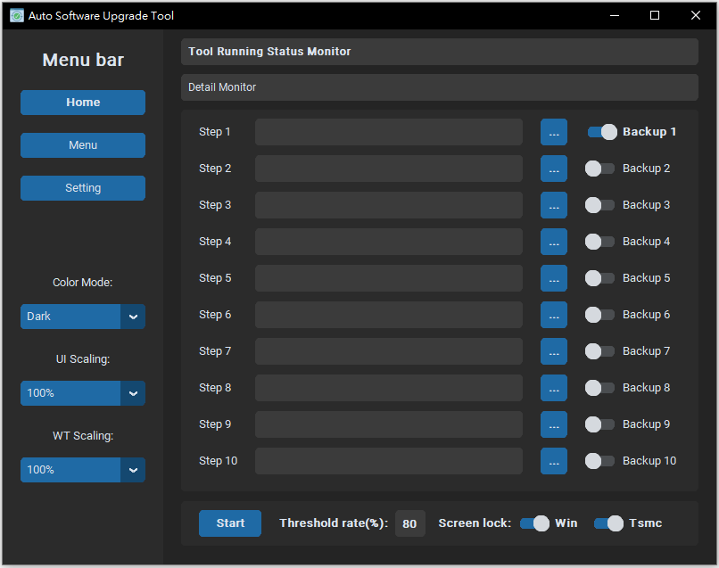
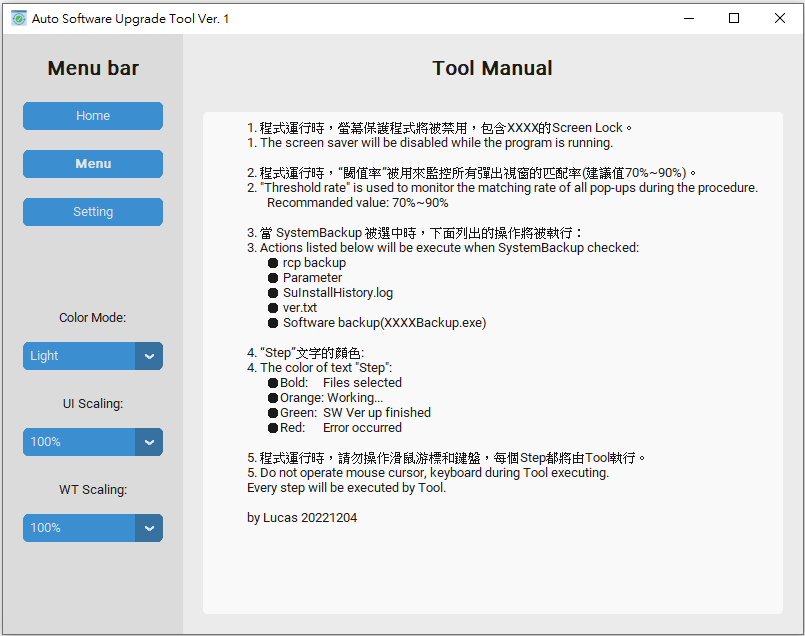
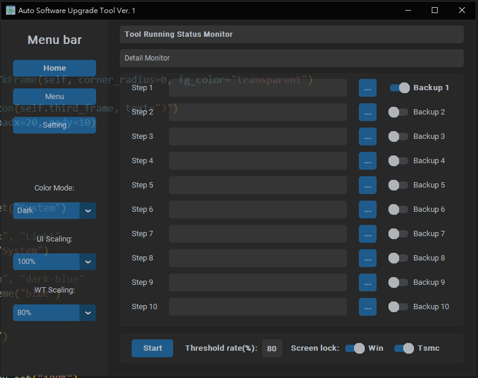

## Execution environment
OS: Windows10

Python: 3.11.0

## Installation
Install the module with pip:
```
pip install customtkinter
pip install thinker
pip install PyAutoGUI
pip install opencv-python
pip install pillow
pip install numpy
```

## Documentation
此工具使用了customtkinter當作Window的框架，再使用opencv來匹配桌面目標並獲取滑鼠座標後使用PyAutoGUI進行操作。

This tool uses customtkinter as the framework for the window, and uses opencv to match the desktop target and obtain the mouse coordinates, and then uses PyAutoGUI for operation.


| _`AutoSoftwareUpgradeTool.py` on Windows 10 with Dark mode_


| _`AutoSoftwareUpgradeTool.py` on Windows 10 with Light mode_


| _`AutoSoftwareUpgradeTool.py` on Windows 10 with Light mode -> Menu frame_


| _`AutoSoftwareUpgradeTool.py` on Windows 10 with Dark window transparency 80% mode_
###
